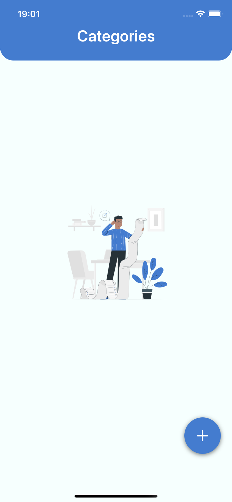
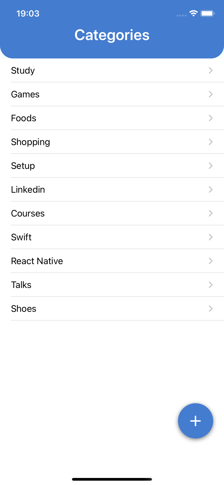
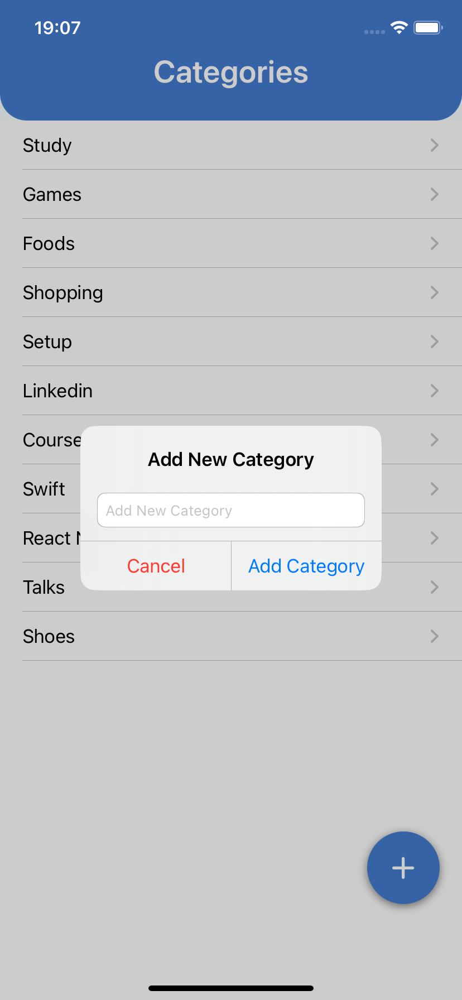
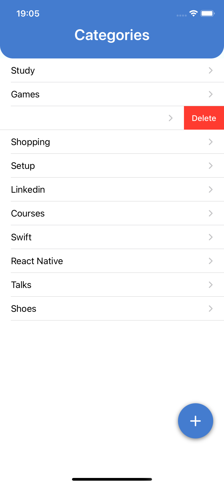
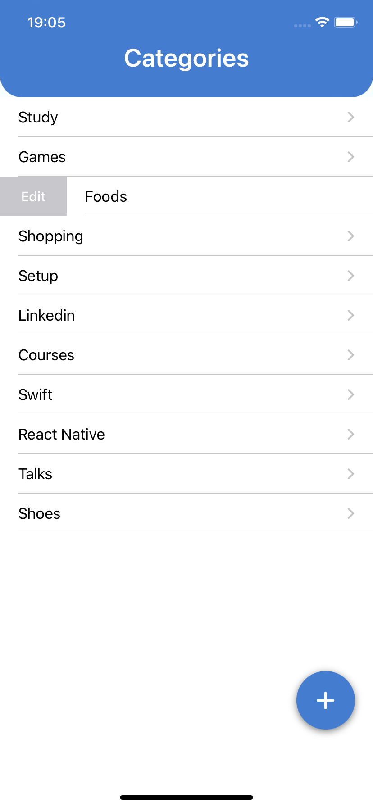
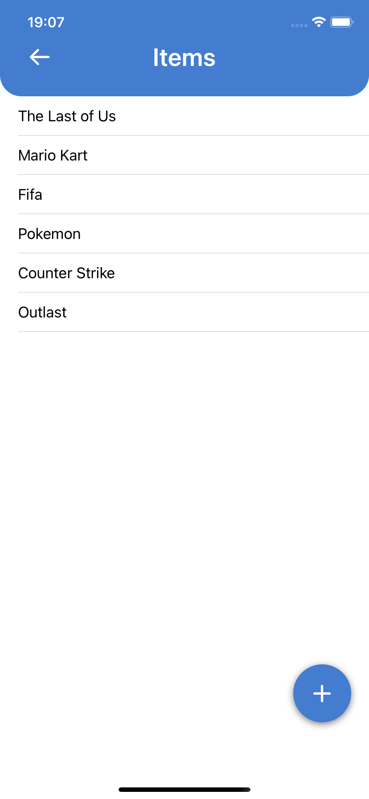
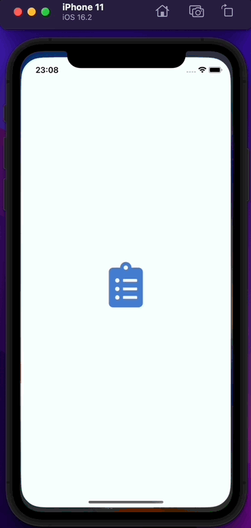
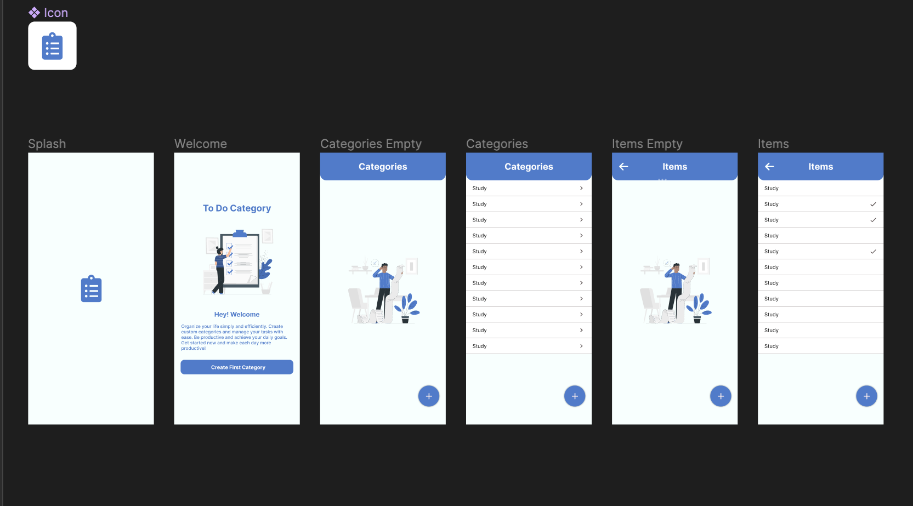

# SWIFT - MVC - To Do Category

 

Project repository **To Do Category** development with **Swift, UIKit, MVC, Constraints, CoreData, RelationShip Tables, Drag and Drop, Swipe Actions, ViewCode. Navigation, Protocol Delegate**

<h3 id="acessar-projeto">📁 Preview</h3>

    
   &nbsp;&nbsp;&nbsp;&nbsp;&nbsp;&nbsp;
  
   &nbsp;&nbsp;&nbsp;&nbsp;&nbsp;&nbsp;
  
  &nbsp;&nbsp;&nbsp;&nbsp;&nbsp;&nbsp;
 
  &nbsp;&nbsp;&nbsp;&nbsp;&nbsp;&nbsp;
 
    &nbsp;&nbsp;&nbsp;&nbsp;&nbsp;&nbsp;
 
    &nbsp;&nbsp;&nbsp;&nbsp;&nbsp;&nbsp;
 

     

    

<h3 id="acessar-projeto">📁 Initializing Clone</h3>

◽ Clone the repository using Git Bash + the command:

       $ git clone git@github.com:IMatheusPiresI/swift-to-do-category.git

<h3 id="sobre">📍 About</h3>

✅ Developed with **Swift, UIKit, MVC, Constraints, CoreData, RelationShip Tables, Drag and Drop, Swipe Actions, ViewCode. Navigation, Protocol Delegate**.  
✅ Project created using MVC pattern. 
✅ Use Core Data for save user To Do Categories and Items.  
✅ Create Swipe actions for edit and delete categories/items.  
✅ Create Drag And Drop for organize categories/items.  
✅ Delete categories and remove referencies for relation ship on Core Data.  
✅ Interfaces, icons, and color palette created by Me using Figma.  

<h3 id="autor">🌁 Figma</h3>

-> Access figma and check out the creation of the application and flow of screens. 
-> Link Figma Project: <a href="https://www.figma.com/file/tjciiy0mTffOwCFqbgqsKH/To-Do-Category?type=design&node-id=0%3A1&mode=design&t=QWA32YtKisA4PBQW-1">Swift To Do Category Project</a>

    

<h3 id="autor">✒️ Author</h3>

  
